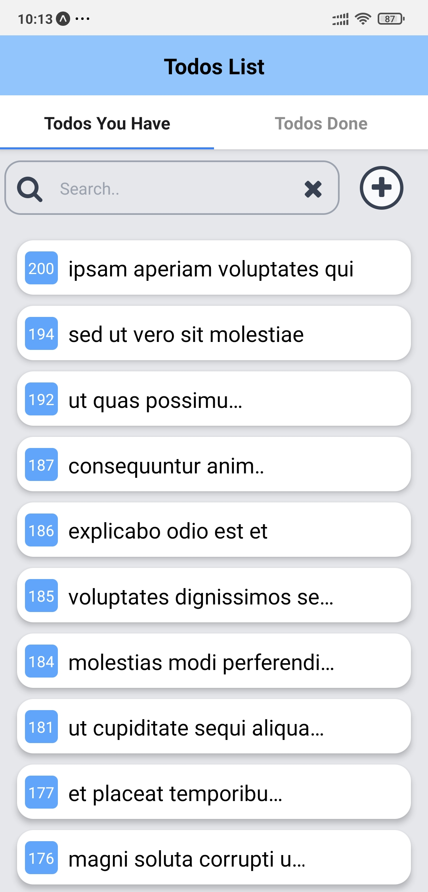
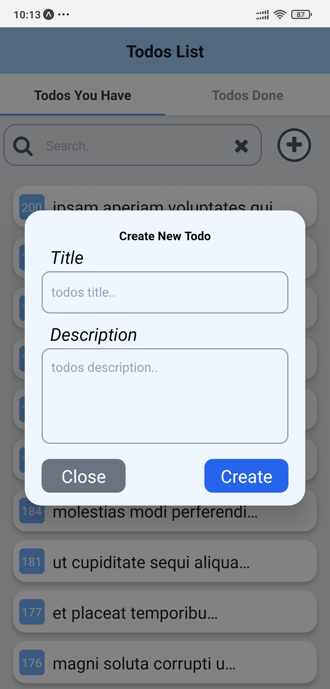
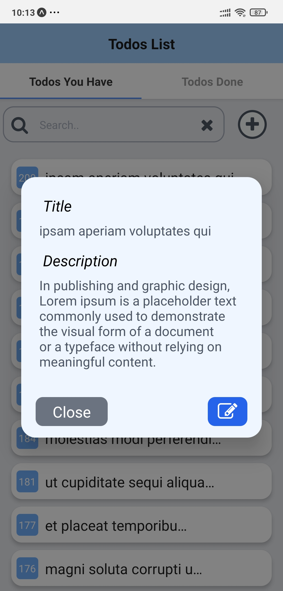
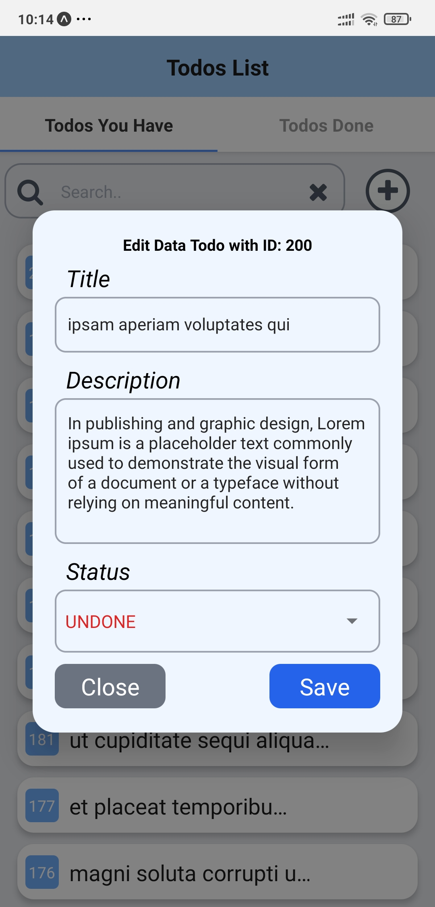
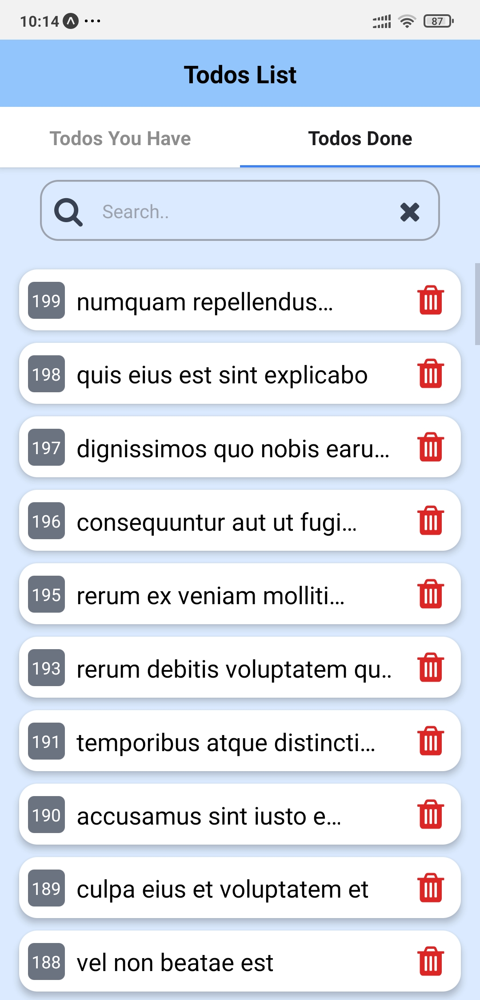
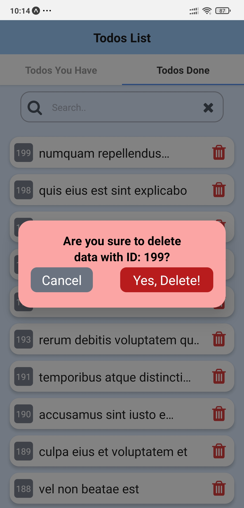
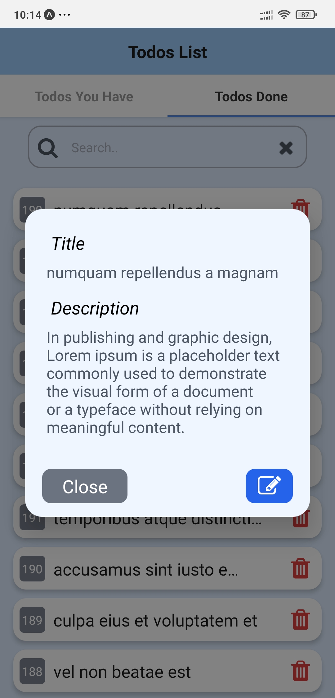
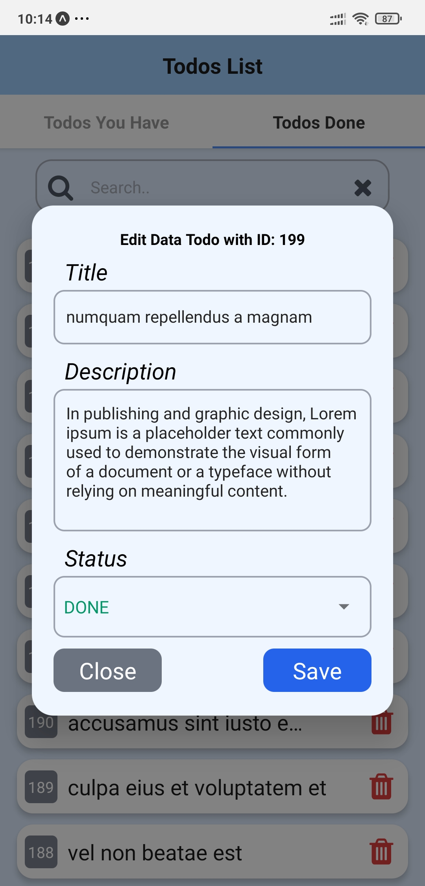

# bit_ifan_ramadhany - todos app

> **Berikut adalah beberapa Screenshots dan sedikit penjelasn untuk todos app**

Pada todos app, untuk membuat todo yang baru hanya bisa dilakukan di screen `Todos You Have` dan Todo hanya bisa di delete ketika status nya sudah `Done` (artinya dapat dilakukan delete ketika Todo sudah berada di screen `Todos Done`)

## Todos You Have 01

## Todos You Have 02

## Todos You Have 03

## Todos You Have 04

## Todos Done 01

## Todos Done 02

## Todos Done 03

## Todos Done 04

## Terima Kasih :)
